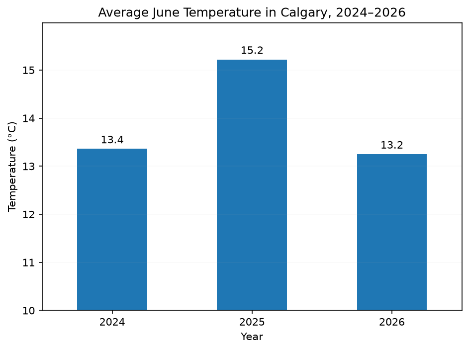

# Practice 1: Average June Temperature, 2024-2026

Calculate and visualize Calgary's average June temperature for 2024–2026 using hourly ERA5 weather data.

## Problem

Show the average June temperature in Calgary for each of the last three years.

## Parameters

- Data Source: Open-Meteo Historical Weather API (ERA5)
- Data Format: CSV
- Source Grain: Hourly
- Timezone: America/Edmonton
- Output Grain: One June average per year
- Tools: Python, pandas, matplotlib
- Output: Vertical bar chart
- Additional Practice: N/A

## Method

1. Load the prepared hourly weather.csv dataset.
2. Inspect its structure and quality.
3. Filter observations to June 2024–2026.
4. Aggregate hourly temperature to one mean per year.
5. Visualize the resulting yearly averages.

## Output



## Reproduction

```bash
uv sync
uv run python prepare_data.py
```

Then run analysis.ipynb

## Data & Attribution

[Open-Meteo](https://open-meteo.com/) ERA5 data, licensed under [CC BY 4.0](https://creativecommons.org/licenses/by/4.0/). Contains modified Copernicus Climate Change Service information (2026).

Neither the European Commission nor ECMWF is responsible for any use that may be made of the Copernicus information or data contained in this project.