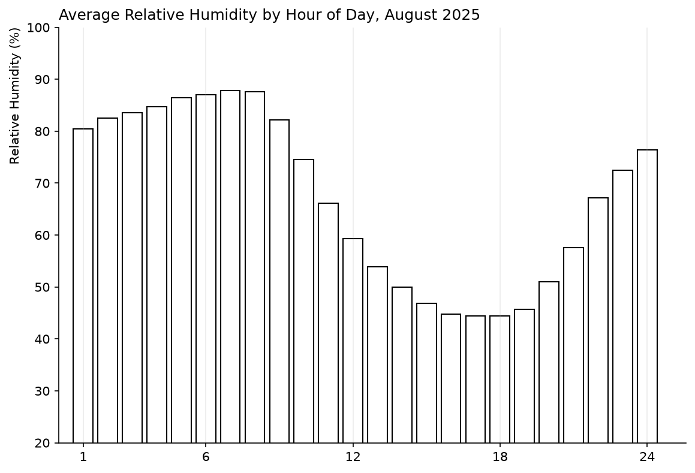

# Practice 5: Average Relative Humidity by Hour of Day, August 2025

Calculate and visualize Calgary's average relative humidity for each hour of the day during August 2025.

## Problem

Show the average relative humidity in Calgary at each hour of the day during August 2025.

## Parameters

- Data Source: Open-Meteo Historical Weather API (ERA5)
- Data Format: CSV
- Source Grain: Hourly
- Timezone: America/Edmonton
- Output Grain: One average relative humidity value per hour of day
- Tools: Python, pandas, matplotlib
- Output: Vertical bar chart
- Additional Practice:
  - Relative humidity as a new variable
  - Grouping by hour of day
  - Matplotlib bar styling, ticks, and grid lines

## Method

1. Load the prepared hourly weather.csv dataset.
2. Inspect its structure and quality.
3. Filter observations to August 2025.
4. Aggregate hourly weather data to average relative humidity per hour of day.
5. Visualize the resulting hourly average humidity.

## Output



## Reproduction

```bash
uv sync
uv run python prepare_data.py
```

Then run analysis.ipynb.

## Data & Attribution

[Open-Meteo](https://open-meteo.com/) ERA5 data, licensed under [CC BY 4.0](https://creativecommons.org/licenses/by/4.0/). Contains modified Copernicus Climate Change Service information (2026).

Neither the European Commission nor ECMWF is responsible for any use that may be made of the Copernicus information or data contained in this project.