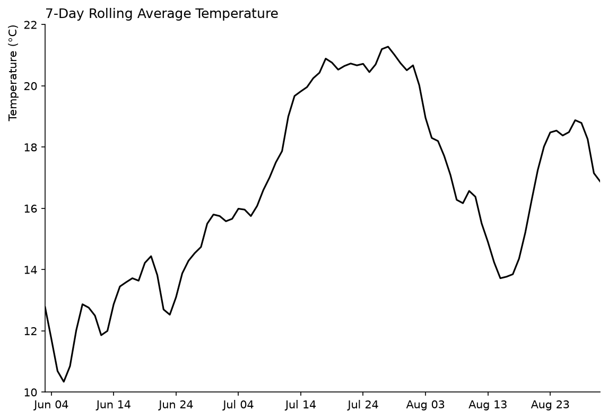

# Practice 4: 7-Day Rolling Average Temperature, Final 90 Days

Calculate and visualize Calgary's 7-day rolling average daily temperature over the final 90 days of available weather data.

## Problem

Show how Calgary's daily average temperature changed over the final 90 days of available data using a 7-day rolling mean.
## Parameters

- Data Source: Open-Meteo Historical Weather API (ERA5)
- Data Format: CSV
- Source Grain: Hourly
- Timezone: America/Edmonton
- Output Grain: One 7-Day Rolling Average Temperature per day
- Tools: Python, pandas, matplotlib
- Output: Line Graph
- Additional Practice:
  - Updated Visualize Section

## Method

1. Load the prepared hourly weather.csv dataset.
2. Inspect its structure and quality.
3. Aggregate hourly temperature to daily average temperature.
4. Calculate the 7-day rolling mean of daily average temperature.
5. Filter observations to the final 90 days of available data.
6. Visualize the resulting rolling average temperatures.

## Outputs



## Reproduction

```bash
uv sync
uv run python prepare_data.py
```

Then run analysis.ipynb.

## Data & Attribution

[Open-Meteo](https://open-meteo.com/) ERA5 data, licensed under [CC BY 4.0](https://creativecommons.org/licenses/by/4.0/). Contains modified Copernicus Climate Change Service information (2026).

Neither the European Commission nor ECMWF is responsible for any use that may be made of the Copernicus information or data contained in this project.