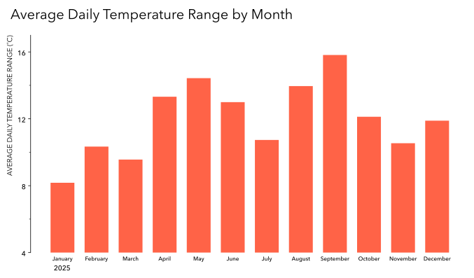
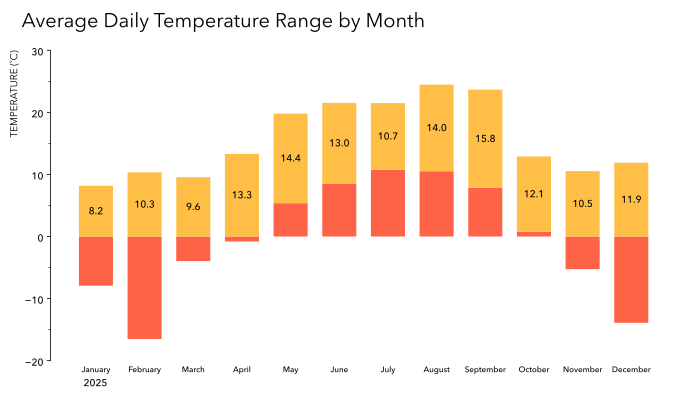
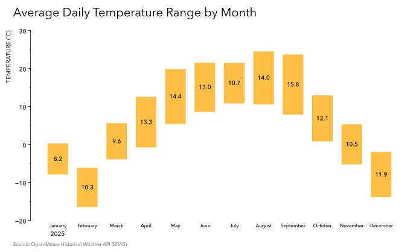

# Practice 6 Notes

## Analytical Transformation

The core transformation is:

`hourly observations → daily minimum / maximum → daily range → monthly averages`

The daily table contains approximately:

`date | min_temp | max_temp | daily_temp_range`

where:

`daily_temp_range = max_temp - min_temp`

The monthly table retained for visualization contains approximately:

`month | min_temp | max_temp | temp_range`

where each value represents the monthly average of its corresponding daily measure.

Because the same daily population is used for all three quantities:

`mean(daily max - daily min) = mean(daily max) - mean(daily min)`

The monthly average minimum and maximum were retained alongside the derived range because later visualizations required the endpoints of the interval rather than only its magnitude.

This became an example of how the intended communication output can affect which otherwise-valid analytical columns are retained downstream.

## Visualization Iterations

### V1 — Direct Range Magnitude

The first version represents average daily temperature range as a simple categorical magnitude.

Each bar begins at zero and its height represents that month's average daily temperature range.

This makes comparisons of range magnitude straightforward because every bar shares the same baseline.

The limitation is that temperature context disappears.

For example, these two intervals have the same range:

`-8°C → 4°C`

`10°C → 22°C`

Both produce a range of 12°C.

V1 therefore communicates the magnitude of the range well, but not where that range lies on the temperature scale.

---

### V2 — Contextual Stacked-Bar Prototype — Failed

The second version attempted to preserve temperature context while retaining familiar stacked-bar geometry.

The intended construction was:

- a contextual segment from zero to the average daily minimum temperature;
- a focal segment from the average daily minimum to the average daily maximum;
- the focal segment's height representing the average daily temperature range.

Conceptually:

`0 → average minimum → average maximum`

This initially appeared useful because the reader could see both the magnitude of the range and approximately where it occurred on the temperature scale.

The design fails when the average daily minimum becomes negative.

For a positive minimum, the construction can behave visually like a conventional stack:

`0 → minimum → maximum`

For a negative minimum:

- the contextual minimum bar extends downward from zero;
- the actual low-to-high range begins below zero;
- the range crosses zero while moving toward the maximum.

The rectangles therefore overlap rather than behaving as additive stacked components.

The problem is semantic, not merely graphical.

The contextual segment and the temperature range are not consistently additive quantities when the minimum can cross zero.

One attempted workaround was effectively:

`bottom = maximum(0, average minimum)`

This prevents the focal bar from beginning below zero, but it changes what the rectangle represents.

For example:

`minimum = -8°C`

`maximum = 4°C`

`range = 12°C`

The correct interval is:

`-8°C → 4°C`

Clamping the bottom to zero instead creates:

`0°C → 12°C`

The rectangle still has a height of 12°C, but its endpoints no longer correspond to the average minimum and maximum temperatures.

The workaround therefore preserves range magnitude while breaking the intended temperature context.

V2 was retained because the failure exposed a limitation in the encoding rather than merely a coding mistake.

---

### V3 — Floating Temperature Range Bars

The third version removes the artificial zero-to-minimum contextual segment.

Each bar is instead defined by:

`bottom = average daily minimum`

`height = average daily maximum - average daily minimum`

Therefore:

`top = average daily maximum`

Each rectangle directly represents the month's average low-to-high daily temperature interval.

This construction works consistently whether the interval:

- lies entirely below zero;
- crosses zero;
- or lies entirely above zero.

The temperature range is labelled directly inside each bar.

V3 therefore preserves both:

- the magnitude of the average daily range;
- its position on the temperature scale.

Compared with V1, it sacrifices some immediacy in pure magnitude comparison because the bars no longer share a common baseline.

Compared with V2, it preserves the intended low-to-high semantics without special treatment for negative temperatures.

V3 was retained as the final visualization.

## Other Visualizations Considered

Several other representations of the same analytical result were considered but not completed.

### Horizontal dumbbell plot

One row per month, with separate minimum and maximum endpoints connected by a line.

This would preserve both endpoints while making the distance between them directly visible.

### Vertical high-low interval plot

One month per x-position with a vertical line connecting the average daily minimum and maximum.

This would preserve chronological month order while representing the interval without rectangular area.

### Low/high line chart with filled band

Separate monthly low and high lines with `fill_between()` representing the range between them.

This would place more emphasis on the seasonal progression of the temperature envelope than on categorical range magnitude.

### Slopegraph

This was also considered, although it seemed less semantically natural because the monthly minimum and maximum are endpoints of an interval rather than two states undergoing change.

These alternatives remain possible future visualization exercises, but completing every plausible representation was not necessary for this practice.

## Matplotlib Practice

The visualization work required additional practice with:

- floating and stacked bar geometry;
- `bottom=`;
- `BarContainer` objects;
- `bar_label()`;
- categorical x-coordinates;
- text and annotation positioning;
- major and minor ticks;
- data coordinates;
- Axes coordinates;
- figure coordinates;
- blended coordinate transforms;
- typography and font weights;
- spines, labels, ticks, and secondary visual elements;
- visual hierarchy.

## Practice Reflection

The analytical transformation itself was comparatively manageable:

`hourly observations → daily minimum / maximum → daily range → monthly averages`

The larger difficulty became deciding how the analytical result should be represented and then implementing those representations efficiently in Matplotlib.

V1 showed that the derived range alone supports a straightforward magnitude comparison.

V2 attempted to preserve additional temperature context through stacked-bar geometry, but negative temperatures revealed that the proposed components were not genuinely additive.

V3 preserved the contextual objective while changing the geometry so that each mark directly represented the actual low-to-high interval.

The exercise reinforced an important distinction:

**analytical result ≠ single inevitable visualization**

The same analytical result can support multiple defensible representations, each emphasizing different properties:

- V1 emphasizes range magnitude;
- V3 emphasizes range magnitude within temperature context;
- a dumbbell plot would emphasize endpoints and distance;
- a high-low plot would emphasize the interval itself;
- a low/high band would emphasize seasonal progression.

The appropriate representation therefore depends not only on the analytical table but on what relationship the reader should perceive most quickly.

The exercise also exposed a current fluency limitation.

Too much time was still required to retrieve, test, and manipulate ordinary Matplotlib mechanics while experimenting with visual forms.

The desired future state is not to produce every possible visualization.

It is to make ordinary graphical construction cheap enough that, when comparing two or three representations would genuinely improve the analytical decision, those alternatives can be prototyped without causing a single practice exercise to expand disproportionately.

Stopping after V3 therefore represented deliberate scope control rather than an unfinished analytical task.