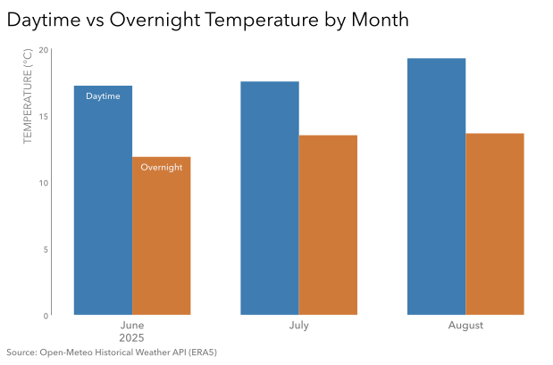
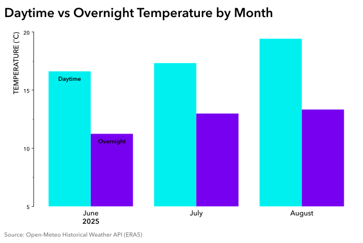

# Practice 7: Daytime vs Overnight Temperature by Month, Summer 2025

Calculate and visualize Calgary's average monthly daytime and overnight temperatures for June, July, and August 2025 using explicit fixed-hour definitions.

## Problem

Show Calgary's average monthly daytime and overnight temperatures for the summer months of 2025, defining daytime as 06:00 through 20:59 and overnight as 21:00 through 05:59.

## Parameters

- Data Source: Open-Meteo Historical Weather API (ERA5)
- Data Format: CSV
- Source Grain: Hourly
- Timezone: America/Edmonton
- Input Columns: `time`, `temperature_2m`
- Analytical Population: June 1 through August 31, 2025
- Output Grain: One row per month with separate Daytime and Overnight mean temperature columns
- Tools: Python, pandas, Matplotlib
- Output: SVG grouped bar chart
- Additional Practice:
  - Blind first run (allowing README template, prepare_data.py, and pandas/Matplotlib documentation)
  - Selective CSV loading with `usecols`
  - Updated Inspect (compart structureal inpection + targeted value sanity checking)
  - Updated date filtering using: `between(..., inclusive="left")`
  - Attempted Validation Stage
  - Grouping by multiple dimensions + reshaping with `pivot()`
  - Gray (SWD-inspired) structural styling
  - Direct labeling at the top of the first Bar Containers
  - Variable Structured colouring
  - Object-oriented matplotlib construction corrections
  - Artist-derived positioning and adjustments (`get_x()`, etc.)
  
## Method

1. Load the prepared hourly `weather.csv` dataset.
2. Inspect its structure, temporal integrity, missingness, duplication, and temperature-value plausibility.
3. Filter observations to Summer 2025.
4. Classify each hour as Daytime (06:00–20:59) or Overnight (21:00–05:59).
5. Aggregate hourly temperatures to monthly mean temperature by month and period.
6. Pivot the analytical result into separate Daytime and Overnight columns.
7. Visualize the monthly daytime and overnight temperature averages.

## Output

#### Revised Visualization


 
The revised visualization keeps the bars on a zero baseline, directly identifies the two series, subordinates non-data structure with gray styling, and gives Daytime and Overnight comparable visual weight.

#### Initial Blind Visualization


 
The blind output is retained as comparison evidence for the later analytical and visualization corrections.


## Reproduction

```bash
uv sync
uv run python prepare_data.py
```

Then run `analysis.ipynb`.

## Data & Attribution

Open-Meteo ERA5 data, licensed under CC BY 4.0. Contains modified Copernicus Climate Change Service information (2026).

Neither the European Commission nor ECMWF is responsible for any use that may be made of the Copernicus information or data contained in this project.
