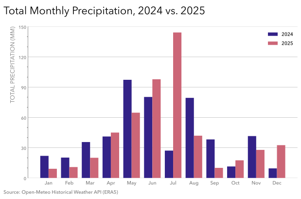

# Practice 8: Monthly Precipitation, 2024 vs 2025

Calculate and visualize Calgary's total monthly precipitation for each month in 2024 versus 2025.

## Problem

Compare Calgary's total precipitation for each calendar month of 2024 and 2025.

## Parameters

- Data Source: Open-Meteo Historical Weather API (ERA5)
- Data Format: PostgreSQL
- Source Grain: Hourly
- Source Timezone: UTC
- Analytical Timezone: America/Edmonton
- Input Columns: `time`, `precipitation`
- Output Grain: one row per calendar month with separate 2024 and 2025 total precipitation columns
- Tools: Python, pandas, Matplotlib, PostgreSQL, psycopg, SQLAlchemy, python-dotenv
- Output: SVG grouped bar chart
- Additional Practice:
  - Loading from PostgreSQL using SQLAlchemy `URL` and `create_engine` with `pd.read_sql_query`
  - Use a `.env` and set up a `.env.example` for local database configuration
  - Filtering with Calgary-local `TIMESTAMPTZ` and converting returned timestamps to `America/Edmonton`
  - Compact structural inspection with targeted value sanity checking
  - Additional inspection of a zero-heavy precipitation distribution using zero share, quantiles, positive-only descriptive statistics, and largest observed values
  - Grouping by multiple dimensions + reshaping with `pivot_table()`
  - Variable Structured colouring
  - Gray (SWD-inspired) structural styling
  - Light horizontal major gridlines
  - Compact frameless legend

## Method

1. Connect to PostgreSQL using .env based configuration and a SQLAlchemy engine.
2. Query only `time` and `precipitation` from the Practice 8 table and filter to Calgary-local calendar years 2024 and 2025.
3. Convert returned timestamps to `America/Edmonton`.
4. Inspect source structure, temporal integrity, missingness, duplication, and precipitation-value plausibility.
5. Inspect the zero-heavy precipitation distribution more closely using zero share, quantiles, positive-only descriptive statistics, and the largest hourly values.
6. Aggregate hourly precipitation to monthly total precipitation by month and year.
7. Reshape the analytical result into one row per calendar month with separate 2024 and 2025 columns using `pivot_table()`.
8. Visualize the monthly totals as paired bars.

## Output

#### Visualization


 
The grouped-bar figure compares 2024 and 2025 across all twelve calendar months, uses abbreviated month labels and a zero baseline, and keeps structural elements visually subdued so the month-by-month precipitation differences remain primary.


## Reproduction

```bash
uv sync
uv run python prepare_data.py
```

Then run `analysis.ipynb`.

## Data & Attribution

Open-Meteo ERA5 data, licensed under CC BY 4.0. Contains modified Copernicus Climate Change Service information (2026).

Neither the European Commission nor ECMWF is responsible for any use that may be made of the Copernicus information or data contained in this project.
