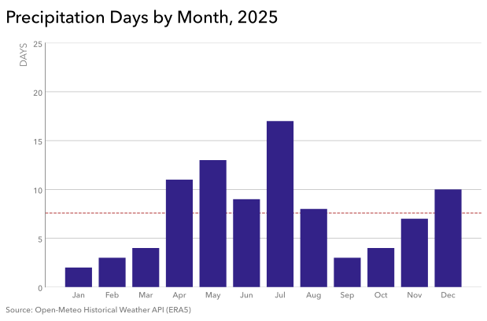

# Practice 9: Precipitation Days by Month, 2025

Calculate and visualize the number of Calgary precipitation days in each month of 2025, where a precipitation day is defined as a day with at least 1 mm of total precipitation.

## Problem

Show how many days in each calendar month of 2025 received at least 1 mm of total precipitation.

## Parameters

- Data Source: Open-Meteo Historical Weather API (ERA5)
- Data Format: PostgreSQL
- Source Grain: Hourly
- Source Timezone: UTC
- Analytical Timezone: America/Edmonton
- Input Columns: `time`, `precipitation`
- Intermediate Grain: One row per Calgary-local calendar day with total daily precipitation
- Output Grain: One row per calendar month with the number of precipitation days
- Tools: Python, pandas, Matplotlib, PostgreSQL, psycopg, SQLAlchemy, python-dotenv
- Output: SVG bar chart
- Additional Practice:
  - Loading from PostgreSQL using SQLAlchemy `URL` and `create_engine` with `pd.read_sql_query()`
  - Using `.env` and `.env.example` for local database configuration
  - Filtering with Calgary-local `TIMESTAMPTZ` boundaries
  - Calgary-local calendar grouping with `AT TIME ZONE`
  - PostgreSQL date handling with `::date`, `DATE_TRUNC()`, and `TO_CHAR()`
  - SQL-side hourly → daily aggregation
  - Threshold-based classification with at least 1 mm of daily precipitation
  - Conditional aggregation with `COUNT(*) FILTER (...)`
  - SQL-side daily → monthly aggregation
  - Inspection and validation of the resulting monthly analytical table in pandas
  - Gray (SWD-inspired) structural styling
  - Light horizontal major gridlines
  - Single-series muted color styling
  - Analytical reference line using `ax.axhline()`
  - Selective emphasis color for the monthly mean reference

## Method

1. Connect to PostgreSQL using `.env`-based configuration and a SQLAlchemy engine.
2. Filter the canonical hourly data to Calgary-local calendar year 2025.
3. Convert each timestamp to Calgary local time and derive its calendar day in SQL.
4. Aggregate hourly precipitation to daily precipitation totals.
5. Count days with at least 1 mm of total precipitation by calendar month using conditional aggregation.
6. Load the resulting monthly analytical table into pandas.
7. Inspect and validate the 12-row analytical result.
8. Visualize the monthly precipitation-day counts as a single-series bar chart with the mean monthly count as a reference line.

## Output

#### Visualization


 
The bar chart shows the number of days in each calendar month of 2025 with at least 1 mm of total precipitation, using abbreviated month labels, a zero baseline, subdued structural styling, and a selectively emphasized reference line showing the mean monthly precipitation-day count for 2025.

## Reproduction

```bash
uv sync
uv run python prepare_data.py
```

Then run `analysis.ipynb`.

## Data & Attribution

Open-Meteo ERA5 data, licensed under CC BY 4.0. Contains modified Copernicus Climate Change Service information (2026).

Neither the European Commission nor ECMWF is responsible for any use that may be made of the Copernicus information or data contained in this project.
